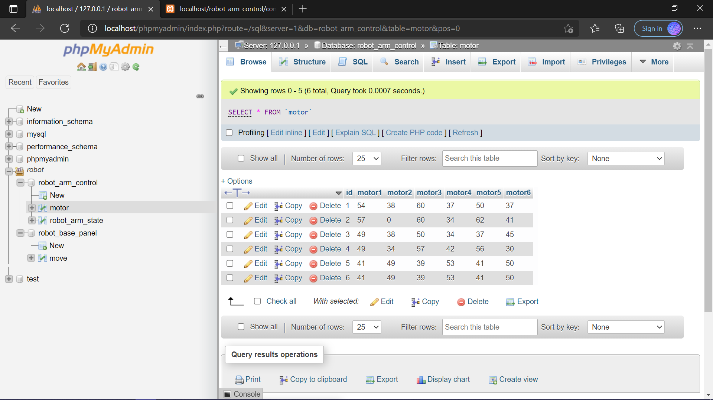
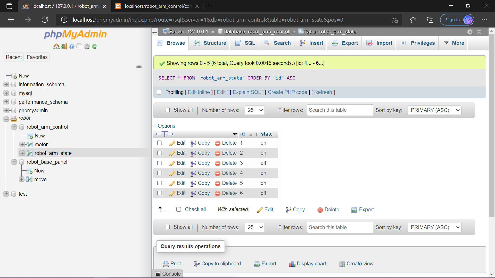

# IOT-Task1-RoborArmPanel
<h3>main page</h3> 

<h3>robot arm control panel page</h3> 
 

<h3> The result after setting the values of the motors and run the arm</h3> 

<h3> The result after setting the values of the motors and Leave the arm off </h3> 

<h3>Result after insert the value of each motors in database</h3> 

<h3>Result after insert the state  of arm in database</h3> 

<h3>link of my websit: </h3>
https://shhadalrahili.github.io/IOT-Task1-RoborArmPanel/

<h3> note :there is video in files of how i got this result</h3> 

